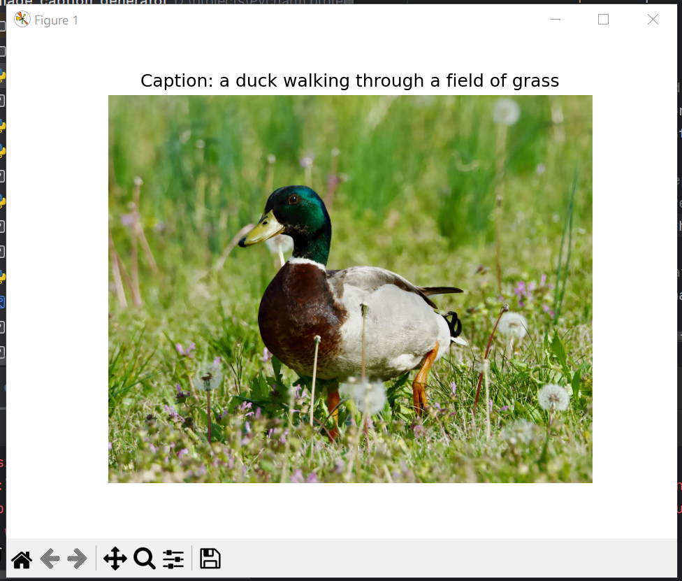

# 🖼️ Image Caption Generator (Custom Model)

This project implements an intelligent **Image Captioning System** that generates descriptive captions for images using a custom-trained model based on **InceptionV3 (CNN)** and **LSTM**.

---

## ⚠️ Project Note

> This model was trained on a relatively small dataset (**Flickr\_8k**), so its performance is best on images similar to the training set. As part of the project evolution, I later switched to using the **BLIP pretrained model from HuggingFace** for improved accuracy and real-world usage. This repo preserves the original training work and deep learning pipeline.

---

## 📌 Features

- 📷 Feature extraction using InceptionV3 (CNN)
- 🧠 Caption generation using LSTM with Beam Search
- 💾 Pretrained custom model (`model.keras`)
- ✅ Sample test image included
- 🧠 Includes tokenizer and caption metadata

---

## 🚀 Tech Stack

| Tool               | Purpose                  |
| ------------------ | ------------------------ |
| Python             | Core programming         |
| Keras / TensorFlow | Deep learning framework  |
| InceptionV3        | CNN feature extractor    |
| LSTM               | Caption generation model |
| Flickr\_8k Dataset | Training dataset         |

---

## 📁 Folder Structure

```
image-caption-generator-custom/
├── Image_proj.py              # Main script to run caption generation
├── generate_caption.py       # Beam search logic
├── model.keras               # Trained LSTM model
├── caption_metadata.pkl      # Vocab size and max length
├── tokenizer.pkl             # Fitted tokenizer
├── test.jpg                  # Sample image for testing
├── Requirements.txt          # Python dependencies
└── README.md                 # This file
```

---

## 📦 Dataset

Originally trained using the **Flickr\_8k dataset**, containing 8000+ captioned images. Dataset is not included here due to size.

🔗 [Flickr\_8k Dataset on Kaggle](https://www.kaggle.com/datasets/adityajn105/flickr8k)

---

## ⚙️ How to Run

### 1. Clone this repository

```bash
git clone https://github.com/Navalakshme/image-caption-generator-custom.git
cd image-caption-generator-custom
```

### 2. Install dependencies

```bash
pip install -r Requirements.txt
```

### 3. Run the project

```bash
python Image_proj.py
```

---

### Sample Caption Generated



*Caption: a duck walking through a field of grass*
---

## 📌 Author

**Navalakshme S R**\
B.E. in Artificial Intelligence & Data Science


---

